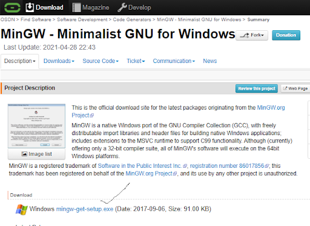
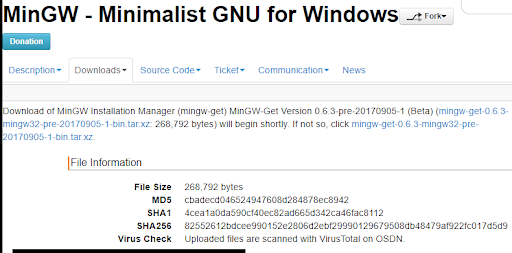
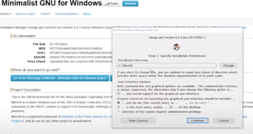
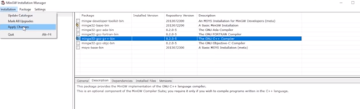
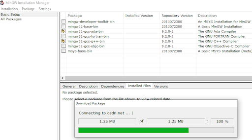
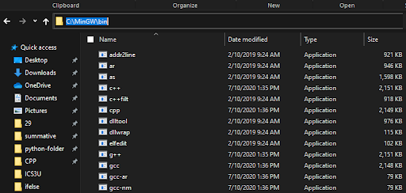
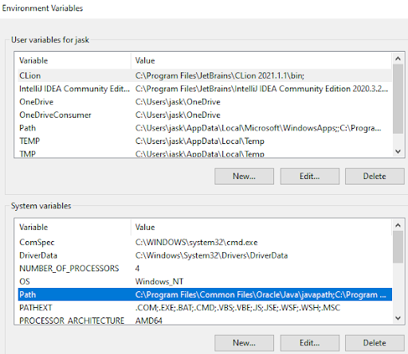
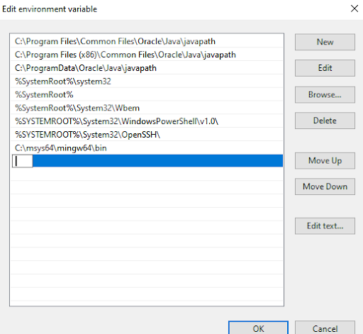

# Install MinGW

Go to https://osdn.net/projects/mingw/

Install base bin and mingw and gcc compiler check and install and click on apply changes

Installation is completed now go to this pc and click on C:\ and you will see a mingw folder, click on that, then click
on bin

## Environment variables

Make sure that there is mingw64\bin contained somewhere there

